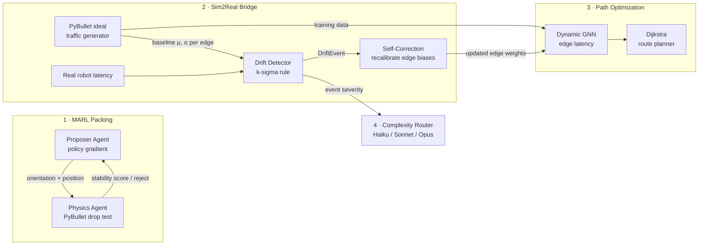

# MARL-Sim2real

Multi-Agent Reinforcement Learning for 3D bin packing with physics-validated
stability, a Sim2Real bridge, real-time GNN path optimization, and
token-optimised LLM tooling. The repository contains **two complementary
tracks** that share the same core ideas:

| Track | Packages | Stack | Focus |
|---|---|---|---|
| **A — Full pipeline** | `marl_sim2real/` | torch + PyBullet + networkx | MARL packing → PyBullet ideal traffic data → dynamic GNN path optimization → k-sigma drift detection → GNN self-correction → complexity-routed LLM calls |
| **B — Numpy-only core** | `marl_packing/`, `semantic_cache/` | numpy (PyBullet optional) | PPO-lite MARL packing with a learned veto critic, domain randomization, reality-gap calibration, and a vector-graph semantic cache for ultra-long LLM contexts |

Both tracks run headless and are exercised by the same CI (`python -m pytest tests/ -q`).

---

# Track A — `marl_sim2real`: the end-to-end pipeline

Four systems chained together:

1. **Multi-Agent RL packing** — a *Proposer Agent* learns to propose 3D packing
   orientations; a *Physics Agent* validates every proposal by dropping the item
   in a **PyBullet** simulation and measuring stability. They cooperate through a
   shared reward.
2. **Dynamic GNN path optimization** — a graph neural network re-embeds a
   warehouse waypoint graph on every tick and predicts per-edge traversal
   latency; Dijkstra plans robot routes over the predicted weights in real time.
3. **Sim2Real drift detection** — PyBullet generates *ideal* traffic data
   (per-edge latency distributions). Live robot latency is compared against this
   baseline; a deviation beyond **k standard deviations** triggers a
   **self-correction** script that recalibrates the GNN's edge weights.
4. **Token-cost optimization** — a complexity router scores each LLM task and
   switches between small/medium/large Claude models, so routine narration never
   pays large-model prices.



## Quickstart

```bash
pip install -e ".[dev]"          # numpy, torch, pybullet, networkx, pyyaml, pytest
python -m pytest tests/ -q       # full test suite, both tracks

python scripts/run_pipeline.py   # compact end-to-end demo of every stage
```

Stage-by-stage (full-size runs):

```bash
python scripts/train_marl.py --episodes 200        # 1. train the packing agents
python scripts/generate_sim_data.py --runs 30      # 2. PyBullet baseline + GNN pre-train
python scripts/monitor_drift.py --ticks 120 --k 3  # 3. live drift monitoring + self-correction
```

Everything degrades gracefully: without PyBullet a heuristic physics fallback is
used, and without `ANTHROPIC_API_KEY` the router returns deterministic offline
stubs — so the whole pipeline runs in CI.

## Step-by-step implementation guide

This section walks through how Track A is built, in the order you would build
it yourself.

### Step 1 — The packing environment (`marl_sim2real/envs/packing_env.py`)

The bin is a `W×D` **heightmap**: each cell stores the current stack height.
This turns 3D packing into a 2.5D problem that is cheap to simulate and easy
to featurize.

- An **item** is a box `(w, d, h)` in grid cells. An **orientation** is one of
  the 6 axis permutations of those dims.
- An **action** is a single integer decoding to `(orientation, x, y)`.
  The resting height `z` is computed by gravity: the max heightmap value under
  the item's footprint.
- The **observation** is the normalized heightmap plus the current item's
  dimensions — everything the proposer needs to decide where the item fits.
- `support_ratio()` measures what fraction of the footprint is actually
  supported — used by the heuristic physics fallback.

### Step 2 — The Proposer Agent (`marl_sim2real/agents/proposer_agent.py`)

A REINFORCE policy-gradient agent with a learned value baseline:

- A small MLP maps the observation to logits over all
  `6 × W × D` actions plus a state-value estimate.
- **Feasibility masking**: geometrically impossible placements (out of bounds,
  over height) get `-inf` logits, so the agent only samples valid candidates
  and never wastes physics simulations on nonsense.
- After each episode, discounted returns are normalized, advantages are
  computed against the value baseline, and one clipped gradient step updates
  the policy (entropy bonus keeps exploration alive).

### Step 3 — The Physics Agent (`marl_sim2real/agents/physics_agent.py`)

The second agent doesn't learn — it *judges*. For each proposal it:

1. Builds a headless PyBullet scene (`p.DIRECT`): floor plane + all previously
   committed items as static boxes.
2. Spawns the candidate box 5 mm above its proposed pose and steps the
   simulation ~120 steps so it settles under gravity.
3. Measures **horizontal displacement** and **tilt** (angle between the body's
   local z-axis and world z, recovered from the rotation matrix).
4. Verdict: stable iff displacement ≤ 2 cm and tilt ≤ 10°; also returns a
   smooth score in `[0, 1]` used as shaped reward.

An analytic fallback (support ratio + aspect ratio) keeps everything runnable
where PyBullet isn't available.

### Step 4 — MARL coordination (`marl_sim2real/agents/coordinator.py`)

The cooperative protocol per item:

| Physics verdict | Environment effect | Proposer reward |
|---|---|---|
| stable | placement committed | `10 × volume_gain + 0.5 × stability_score` |
| unstable | item rejected | `−0.5` penalty |

Both agents optimize the same objective (dense *and* stable packing), which
makes this cooperative MARL: the proposer gradually internalizes the physics
agent's judgment and stops proposing configurations that will be rejected.

### Step 5 — Warehouse graph + Dynamic GNN (`marl_sim2real/gnn/`)

- `WarehouseGraph`: a random-geometric graph of waypoints with dynamic node
  features (queue length, robot density) and edge features (distance, load,
  surface type) resampled every tick.
- `DynamicGNN`: plain-torch message passing (no torch_geometric). Each layer
  computes edge messages from `[h_src, h_dst, edge_attr]`, aggregates by
  destination, and residually updates node embeddings. A softplus head predicts
  a **positive latency per edge**. "Dynamic" = same weights, time-varying
  inputs: the graph is re-embedded on every planning call.
- Crucially, the GNN carries a **per-edge calibration bias** parameter —
  a `num_edges`-sized knob that self-correction can tune *without touching the
  shared network weights*.
- `PathOptimizer` converts predicted latencies into a weighted digraph and runs
  Dijkstra — routes shift automatically as congestion changes.

### Step 6 — Ideal data + k-sigma drift detection (`marl_sim2real/sim2real/`)

**Ideal data** (`ideal_data_generator.py`): PyBullet simulates a
velocity-controlled robot traversal (capturing acceleration ramps and friction
losses), scaled per edge by distance and slowed by congestion. Repeating this
over sampled snapshots yields per-edge latency distributions:
the **sim baseline** `(μ_e, σ_e)` — plus (snapshot, latency) pairs that
pre-train the GNN.

**Detection** (`drift_detector.py`): each edge keeps a rolling window of real
observations, and drift triggers when

```
|mean(real_window_e) − μ_e| > k · σ_e        (default k = 3)
```

Windowed means (rather than single samples) reject one-off sensor spikes while
still reacting within one window length. The emitted `DriftEvent` carries edge
ids, z-scores, and observed vs expected means.

**Self-correction** (`self_correction.py`): two coordinated mechanisms fire on
every event —

1. **Baseline EMA** — pull `μ_e` toward observed reality (and widen `σ_e`) so
   the detector converges instead of re-firing forever on a known gap.
2. **Targeted bias fine-tuning** — freeze the shared GNN, mask the loss to the
   drifted edges only, and take a few gradient steps on the per-edge biases
   against recent real observations. Planning immediately reflects corrected
   latencies; the rest of the network is untouched, so a handful of local
   measurements can't destabilize global predictions.

Each correction is logged (JSONL) with pre/post prediction error on the
drifted edges — the demo shows error dropping and z-scores decaying across
successive events (e.g. 11.9σ → 8.8σ → 5.1σ).

### Step 7 — Token optimization by model switching (`marl_sim2real/llm/`)

Operational LLM tasks (narrating drift events, diagnosing failures) vary
hugely in difficulty. The router computes a complexity score in `[0, 1]` from
cheap signals:

| Signal | Weight | Intuition |
|---|---|---|
| prompt length (saturating) | 0.15 | more context to digest |
| drift severity above 3σ | 0.30 | 3σ is routine, 8σ+ is an anomaly |
| affected-edge blast radius | 0.20 | multi-edge failures need cross-edge reasoning |
| caller-flagged reasoning | 0.35 | multi-step logic required |
| prior failed attempts | +0.35 each | escalate on failure |

and thresholds it into tiers: `< 0.33 →` **Haiku**, `< 0.66 →` **Sonnet**,
else **Opus**. Every decision is recorded; `savings_report()` compares realized
cost against always-using-the-largest-model (the demo shows ~47–93% savings
depending on the event mix). With `ANTHROPIC_API_KEY` set, calls go to the real
API; otherwise a deterministic offline stub keeps the pipeline self-contained.

---

# Track B — `marl_packing` + `semantic_cache`: the numpy-only core

An independent implementation of the MARL packing idea that runs on **numpy
alone** — no torch, no GPU, no API keys — plus a graph-based semantic cache:

- `marl_packing/` — a voxel-grid packing env where the environment doesn't
  decide stability itself: a **PPO-lite Proposer** (numpy MLP with manual
  backprop) proposes placements and a **Physics Agent** (stability rules + a
  learned critic, optional PyBullet backend) can **veto** them. The Sim2Real
  side does train-time **domain randomization**, a **RealityGapCalibrator**
  that widens randomization and fine-tunes the critic from paired sim/real
  outcomes, and a deployment **bridge** with a digital twin and safety filter.
- `semantic_cache/` — a vector-graph hybrid for ultra-long LLM contexts:
  overlapping chunks are indexed in a cosine vector store *and* wired into a
  graph (sequential/entity/semantic edges); retrieval seeds spreading
  activation from vector hits and returns coherent *context clusters* instead
  of isolated top-k chunks.

```bash
python scripts/train.py --episodes 200 --randomize   # train both agents (numpy)
python scripts/evaluate.py                           # sim eval + sim2real deployment
python scripts/demo_cache.py                         # semantic cache walkthrough
```

Design decisions and data flow in depth: [docs/ARCHITECTURE.md](docs/ARCHITECTURE.md).
Tunables reference: [configs/marl_packing_reference.yaml](configs/marl_packing_reference.yaml).

---

## Repository layout

```
marl_sim2real/                 # Track A (torch + PyBullet)
├── config.py                  # dataclass config + YAML overrides
├── envs/packing_env.py        # heightmap bin-packing environment
├── agents/                    # REINFORCE proposer, PyBullet judge, MARL coordinator
├── gnn/                       # dynamic message-passing GNN + Dijkstra optimizer
├── sim2real/                  # ideal data gen, k-sigma detector, self-correction
└── llm/complexity_router.py   # model switching + savings report
marl_packing/                  # Track B (numpy PPO + veto critic + sim2real bridge)
semantic_cache/                # Track B (vector-graph hybrid retrieval)
scripts/                       # Track A: train_marl, generate_sim_data, monitor_drift,
                               #          run_pipeline · Track B: train, evaluate, demo_cache
configs/                       # default.yaml (Track A) · marl_packing_reference.yaml (Track B)
docs/ARCHITECTURE.md           # Track B design document
tests/                         # combined pytest suite for both tracks
```

## Configuration

Track A knobs live in `configs/default.yaml` and map 1:1 onto the dataclasses
in `marl_sim2real/config.py`. The most important ones:

- `drift.k_sigma` — the detection threshold *k* (default 3.0)
- `drift.window_size` / `min_samples` — reactivity vs robustness trade-off
- `drift.bias_lr` / `recalib_steps` — how aggressively self-correction moves
- `router.low_threshold` / `high_threshold` — model-switching boundaries

Track B is configured via CLI flags and constructor arguments; see
`configs/marl_packing_reference.yaml` for the documented defaults.

## Extending

- Swap REINFORCE for PPO/QMIX in `marl_sim2real/agents/proposer_agent.py`
  (the coordinator API doesn't change) — or study `marl_packing/training/`
  for a PPO-lite reference.
- Replace `RealWorldSimulator` with a ROS/MQTT subscriber feeding real robot
  telemetry into `DriftDetector.update()`.
- Load real warehouse layouts into `WarehouseGraph` instead of the
  random-geometric generator.
- Point `semantic_cache`'s pluggable embedder at a real embedding model.

## License

MIT — see [LICENSE](LICENSE).
