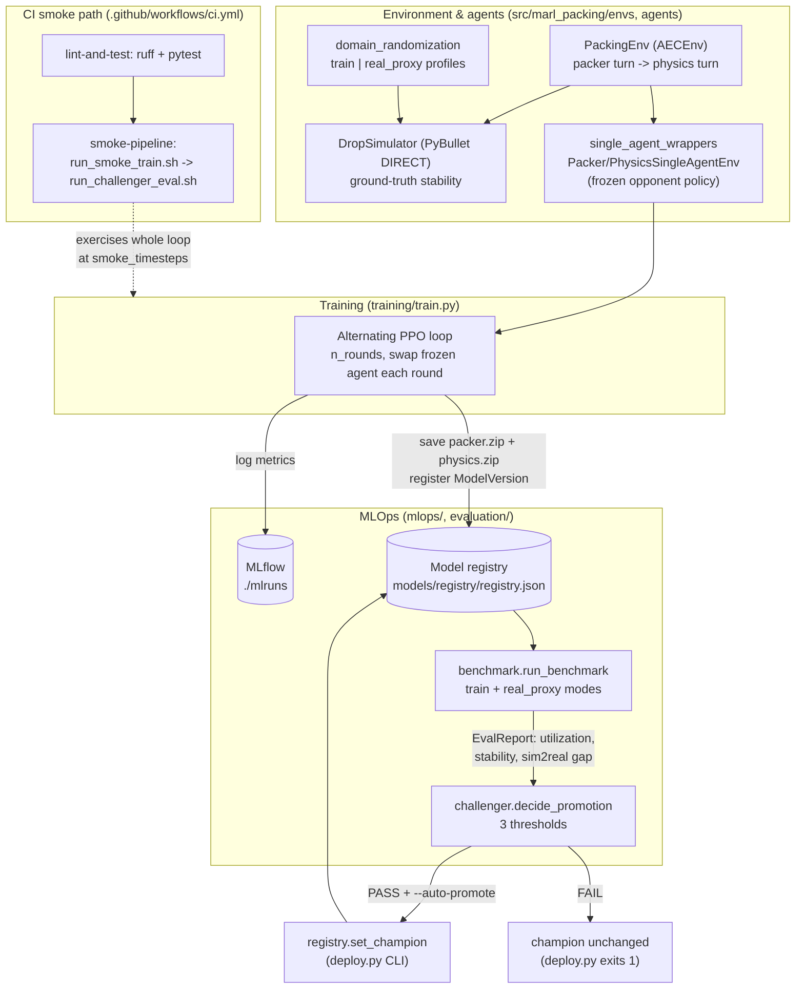

# Architecture

This is the top-level map of the repository: what each piece does and, more
importantly, how the pieces connect end to end. Read it first, then follow the
links at the bottom into the three subsystem deep-dives
([MARL design](MARL_DESIGN.md), [Sim2Real](SIM2REAL.md), [MLOps](MLOPS.md)) when
you need detail.

## System overview

The project trains two cooperating-but-distinct RL agents to pack boxes into a
bin. A **packer** proposes where and how to place the next box (an `(x, y)`
footprint plus one of 6 axis-aligned rotations); a **physics** agent then looks
at that *specific* proposal and decides accept or reject, with a real PyBullet
drop simulation providing the ground-truth "did the stack actually stay
standing" signal. The two agents share one turn-based environment
(`PackingEnv`, a PettingZoo `AECEnv`) but are each trained with off-the-shelf
single-agent PPO by wrapping the shared env so the *other* agent is played by a
frozen policy. Training alternates (train packer with physics frozen, swap,
repeat), logs to MLflow, and saves each trained pair as a new **version** in a
local JSON model registry. A Sim2Real benchmark then runs that pair through
paired episodes under both a narrow "train" domain-randomization profile and a
wider "real_proxy" profile (there is no physical rig — the proxy is a deliberate,
honest stand-in). Finally a Champion/Challenger gate compares the new
"challenger" against the current "champion" on three thresholds and either
promotes it (flips the champion pointer) or leaves the champion untouched. The
whole loop runs as a fast CPU smoke test in CI.

## Data & control flow

## Lifecycle walkthrough: fresh clone to a promoted champion

Every step names the real file, function, or config knob involved.

1. **Set up.** `make setup` installs `requirements.txt` (Gymnasium, PettingZoo,
   Stable-Baselines3, PyBullet, MLflow) and does an editable install of the
   `src/`-layout package (`pyproject.toml`). `make test` runs the pure-logic unit
   tests in `tests/`; `make lint` runs `ruff`.

2. **Load configs.** All tuning lives in diffable YAML read by
   `utils/config.load_config` (there are no config classes). The four files:
   `configs/env.yaml` (bin `1.0×1.0×1.0` m, `grid_resolution 0.05` → a `20×20`
   heightmap, `8` items/episode, item sides sampled in `0.10–0.30` m, PyBullet
   settle/tilt/displacement thresholds, and both randomization profiles),
   `configs/train_packer.yaml` (PPO hyperparameters + the shared
   `schedule`: `n_rounds 4`, `timesteps_per_round 4096`,
   `smoke_timesteps_per_round 256`), `configs/train_physics.yaml` (physics PPO +
   `reward_shaping`), and `configs/challenger_eval.yaml` (the promotion gate).

3. **The environment defines one packing episode.**
   `envs/packing_env.py::PackingEnv` is a PettingZoo `AECEnv` with two agents,
   `["packer", "physics"]`, stepped in that fixed turn order via an
   `AgentSelector`. `reset()` samples `num_items_per_episode` box sizes into an
   item queue and zeroes a `(20, 20)` `float32` heightmap.
   - **Packer turn** (`_apply_packer_action`): action is a `Box(3,)` in `[0,1]`
     — `(x_frac, y_frac, rot_frac)`. `rot_frac` selects one of the 6 rotations
     in `_ROTATIONS` (index permutations of the box's `(w, d, h)`); `x_frac`/
     `y_frac` map to a legal footprint. The resting `base_z` is the max
     heightmap value under that footprint; if the box would exceed bin height the
     placement is flagged `valid=False`. Nothing is committed yet — it becomes a
     `_PendingPlacement`.
   - **Physics turn** (`_apply_physics_action`): action is `Discrete(2)`
     (reject/accept). It observes the heightmap plus the *proposed* box
     (`proposed_item`, a 6-vector of center+dims) — this is why the design is
     AEC, not Parallel: physics must see the packer's actual this-turn proposal.

4. **Ground-truth stability comes from PyBullet.**
   `envs/pybullet_sim.py::DropSimulator` owns one headless (`DIRECT`) PyBullet
   client reused across the whole episode. `simulate_drop()` rebuilds the world
   from the already-committed boxes, drops the candidate from `_DROP_HEIGHT_BONUS_M`
   above its target, and calls `_step_until_settled()` — physics steps at
   `sim_hz 240` until every body's linear/angular velocity stays under
   `settle_lin_vel_thresh`/`settle_ang_vel_thresh` for `settle_hold_steps 10`
   consecutive steps, or `settle_timeout_steps 240` is hit. A drop is `stable`
   iff it settled **and** no box (candidate or any it disturbed) tilted past
   `tilt_fail_deg 15°` (`_orientation_tilt_deg`) or shifted past
   `displacement_fail_m 0.04` m. Masses come from box volume × a nominal density;
   friction/mass/restitution/pose-noise are drawn from the active randomization
   profile.

5. **Five outcomes drive reward shaping** (in `_apply_physics_action`). Rewards
   are per-item and asymmetric between agents:
   - `invalid_height` — box exceeds bin: packer penalized, physics neutral.
   - `accepted_stable` — accept + sim stable: box committed to the heightmap,
     packer rewarded ∝ its volume fraction, physics gets `correct_decision_reward
     +0.2`.
   - `accepted_unstable` — accept + sim collapses: packer penalized, physics gets
     `false_accept_penalty -1.0` (the costly failure mode).
   - `rejected_would_have_been_stable` — reject a would-have-been-stable box: a
     *ghost* sim is run privately (never committed) to score it; physics gets
     `false_reject_penalty -0.3`.
   - `rejected_correctly` — reject a genuinely unstable box: physics gets
     `+0.2`. Rejects always run the ghost sim so physics gets a clean signal
     without polluting the real stack. At the last item, `_advance_item` writes an
     `episode_summary` (`utilization_pct`, `items_placed`) and terminates both
     agents.

6. **Wrappers turn the shared AEC env into two single-agent Gym envs.**
   `agents/single_agent_wrappers.py` exposes `PackerSingleAgentEnv` and
   `PhysicsSingleAgentEnv`. Each presents one agent's turn as an ordinary
   `gym.Env` and internally plays the *other* agent's turn with a frozen
   `Policy` (`predict`) supplied at construction — a `RandomOpponent` before the
   opponent has been trained. This is what lets stock SB3 PPO train each agent
   independently.

7. **Training alternates rounds.** `training/train.py::train` runs `n_rounds`.
   Even rounds train the packer (`PackerSingleAgentEnv`, physics frozen); odd
   rounds train physics (`PhysicsSingleAgentEnv`, packer frozen). Each `PPO` is
   constructed once with `MultiInputPolicy` (the obs is a Dict) then reused via
   `set_env` with `reset_num_timesteps=False`, so learning continues across
   rounds. `--full` uses `timesteps_per_round`; without it, the smoke value.

8. **MLflow captures the run.** The loop runs inside `mlflow.start_run()`,
   logging hyperparameters up front and, via
   `training/callbacks.py::MlflowLoggingCallback`, mirroring SB3 rollout/train
   scalars (namespaced `packer/*` and `physics/*`) into `./mlruns` on each
   rollout end. Browse with `make mlflow-ui`.

9. **The trained pair is registered as a challenger.** After the loop, `train`
   asks `mlops/registry.py::ModelRegistry` for the `next_version_id` (e.g.
   `v1`, `v2`, …), saves `packer.zip` + `physics.zip` under
   `models/registry/<version>/`, and records a `ModelVersion` (paths, timestamp,
   a `train_config_hash`) into `models/registry/registry.json`. The version id is
   printed as the last stdout line.

10. **Evaluate the challenger.** `mlops/deploy.py` (CLI, wrapped by
    `scripts/run_challenger_eval.sh` / `make challenger-eval`) calls
    `mlops/challenger.py::evaluate_challenger`. That loads the pair and runs
    `evaluation/benchmark.py::run_benchmark` twice on the **same seeds**
    (`num_eval_episodes 20`, `eval_seed_base 1000`): once in `train` mode ("sim")
    and once in `real_proxy` mode. Metrics come from `evaluation/metrics.py`:
    `box_utilization_pct`, `stability_success_rate_pct` (share of *accepted*
    placements that were stable), and `sim2real_gap_pct` (`sim − real_proxy`
    utilization). These land in an `EvalReport` and are written back onto the
    version's `metrics` in the registry.

11. **The promotion gate decides.** `challenger.py::decide_promotion` (pure,
    unit-tested in `tests/test_challenger_logic.py`) compares challenger vs
    champion against the three thresholds in `configs/challenger_eval.yaml`, and
    promotes only if **all** pass:
    - utilization improvement ≥ `min_utilization_improvement_pct 1.0` pp,
    - stability regression ≤ `max_stability_regression_pct 2.0` pp,
    - Sim2Real gap regression ≤ `max_sim2real_gap_regression_pct 3.0` pp.
    **Bootstrap case:** if no champion exists yet, `bootstrap_auto_promote: true`
    auto-promotes the first challenger.

12. **Promote (or don't).** In `deploy.py::main`, a PASS with `--auto-promote`
    calls `registry.set_champion(version)`, flipping the champion pointer in
    `registry.json` — the local stand-in for a deploy. A FAIL leaves the champion
    unchanged and exits non-zero. Inspect any packing visually with
    `scripts/visualize_packing.py` (ASCII heightmap, headless).

13. **CI runs the whole thing small.** `.github/workflows/ci.yml` has two jobs:
    `lint-and-test` (ruff + pytest), then `smoke-pipeline`, which runs
    `run_smoke_train.sh` (full alternating loop at `smoke_timesteps_per_round
    256`) and feeds the printed version id into `run_challenger_eval.sh`. This is
    a wiring test — it proves env → agents → PPO → MLflow → registry → benchmark →
    gate → promotion runs end to end, not that a smoke-trained model is any good.
    There is no GPU here; full-scale training is a deliberate, documented
    out-of-scope choice.

## Design decisions and trade-offs

- **AEC (turn-based) over Parallel.** Physics must observe the packer's specific
  proposal before acting — a causal, same-step dependency that PettingZoo's
  `ParallelEnv` (simultaneous, blind-to-each-other actions) cannot express. AEC
  models it directly (`PackingEnv`). The cost is that off-the-shelf single-agent
  trainers don't consume an AEC env natively, which forces step 6's wrappers.

- **Alternating independent-learner PPO over a native multi-agent trainer.**
  Freezing one agent and training the other with stock SB3 PPO
  (`train.py` + `single_agent_wrappers.py`) is simple, debuggable, and
  dependency-light (iterative best-response / alternating self-play). It trades
  away the convergence guarantees and joint-credit-assignment machinery of a
  purpose-built MARL algorithm, and each agent chases a non-stationary (but
  frozen-within-a-round) opponent.

- **Local JSON registry over a heavier model registry.**
  `registry.py` is one `registry.json` plus checkpoint folders, with a narrow
  `add/get/list/set_champion` interface that is the only seam the rest of
  `mlops/` touches. Zero infra, trivially inspectable — at the cost of no
  concurrent-writer safety and no cloud artifact store. Swapping in the MLflow
  Model Registry or an S3-backed store means re-implementing just that interface.

- **Domain-randomization proxy over real hardware.** With no physical rig, the
  `real_proxy` profile (`domain_randomization.py`, wider friction/mass/
  restitution/pose ranges than `train`) stands in for unmodeled real-world
  variation, and `sim2real_gap_pct` measures overfitting to the training
  distribution. This is an *honest proxy*, not a claim of real validation;
  `real_world_reference.csv` is explicitly illustrative placeholder data. Replace
  the proxy profile and that CSV with real measurements to make the gap
  meaningful.

## Deeper dives

- **[docs/MARL_DESIGN.md](MARL_DESIGN.md)** — the two-agent formulation, AEC turn
  order, observation/action spaces, the 6 rotations, reward shaping, and the
  alternating-training scheme.
- **[docs/SIM2REAL.md](SIM2REAL.md)** — the PyBullet drop model, stability
  judging, the train vs real_proxy randomization profiles, and how the Sim2Real
  gap is defined and interpreted.
- **[docs/MLOPS.md](MLOPS.md)** — MLflow tracking, the registry schema, and the
  Champion/Challenger gate (thresholds, bootstrap case, deploy CLI).

> Note: the three companion docs above are the intended homes for subsystem
> detail. If a link is dead, that doc has not been written yet — this file is the
> authoritative high-level synthesis in the meantime.
