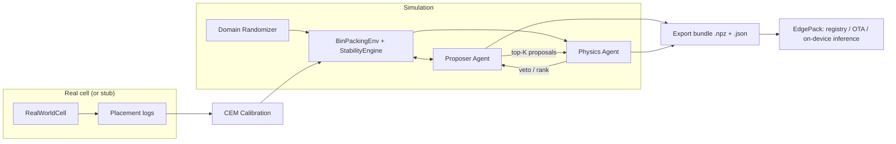

# MARL-Sim2real

Multi-Agent Reinforcement Learning (MARL) for 3D bin packing, with a
Simulation-to-Reality (Sim2Real) bridge that calibrates the simulator against
real-world logs and exports a deployable, framework-free policy bundle for
edge devices.

Two agents cooperate:

- **Proposer Agent** — a policy network that proposes *where* to place the
  current item and in *which of six orientations*.
- **Physics Agent** — a learned stability critic that scores/vetoes each
  proposal. In simulation it is supervised by a ground-truth stability engine;
  on the edge device (where no physics engine exists) the learned model **is**
  the physics check.

The exported bundle (`.npz` weights + `.json` manifest with a SHA-256
integrity hash and reality-gap metrics) is consumed by the companion
**EdgePack** repo for edge MLOps (registry, OTA rollout) and on-device
inference.

Zero heavy dependencies: the whole stack (environment, physics, MLPs with
manual backprop, REINFORCE, CEM calibration) runs on **numpy only**, so it
trains in CI and on-device.

---

## Architecture



## Repository layout

```
marl_sim2real/
├── env/
│   ├── bin_packing_env.py    # heightmap-based 3D bin packing environment
│   └── physics.py            # stability engine (support ratio, COM, topple score)
├── agents/
│   ├── networks.py           # numpy MLP with manual backprop
│   ├── proposer.py           # softmax policy, REINFORCE + baseline, top-K proposals
│   └── physics_agent.py      # binary stability classifier, veto/rank API
├── training/
│   └── marl_trainer.py       # co-training loop + replay buffer
├── sim2real/
│   ├── domain_randomization.py  # per-episode physics parameter sampling
│   ├── real_world.py            # real-cell interface (stubbed with hidden physics)
│   ├── calibration.py           # CEM system identification from real logs
│   └── bridge.py                # 5-stage pipeline orchestrator
└── export/
    └── policy_export.py      # .npz + manifest bundle, hash-verified loading
scripts/
├── train_sim2real.py         # sim-only training
└── run_bridge.py             # full Sim2Real pipeline
tests/                        # 18 unit + integration tests
```

---

## Quick start

```bash
pip install -e ".[dev]"
pytest -q                          # 18 tests, ~4 s

# sim-only MARL training + export
python scripts/train_sim2real.py --episodes 300 --out artifacts/

# the full Sim2Real pipeline
python scripts/run_bridge.py --sim-episodes 300 --adapt-episodes 150 --out artifacts/
```

---

## Step-by-step: how the system is built, end to end

### Step 1 — The environment (`env/bin_packing_env.py`)

The bin is an `L×W` grid with max height `H`, represented as a **heightmap**
(the height of the tallest stack in each cell). This is the same
representation a depth camera gives you on real hardware, which is what makes
Sim2Real tractable.

- **Action** = `(x, y, orientation)`; there are exactly six axis-aligned
  orientations of a box (`ORIENTATIONS` = the 6 permutations of its dims).
- **Observation** = flattened (noisy) heightmap + normalized current item dims.
- **Reward** = placed-volume fraction ×10, plus a compactness bonus for low
  placements, minus penalties for unstable/out-of-bounds proposals.
- `valid_actions_mask()` masks impossible placements so the policy never
  wastes probability mass on them.

### Step 2 — The physics ground truth (`env/physics.py`)

Full rigid-body dynamics is unnecessary for packing; three cheap checks decide
stability:

1. **Support ratio** — fraction of the box footprint touching the surface at
   rest height.
2. **Center-of-mass check** — COM must lie within `com_margin` of the
   supported region.
3. **Topple score** — combines aspect ratio, unsupported area, mass, and
   friction into a perturbation-survival score.

All five parameters (`support_threshold`, `com_margin`, `friction`,
`mass_noise`, `sensor_noise`) live in `PhysicsParams` — the exact vector the
Sim2Real layer randomizes and later calibrates.

### Step 3 — The two agents (`agents/`)

- `networks.py` implements a tanh MLP with **manual backprop** (forward caches
  activations; backward does clipped SGD). Both agents build on it.
- **Proposer** (`proposer.py`): softmax policy over the flat `L·W·6` action
  space. `propose()` samples **top-K candidates** (not just one) — this is the
  channel the two agents negotiate over. Trained by REINFORCE with a
  moving-average baseline and an entropy bonus.
- **Physics Agent** (`physics_agent.py`): takes (observation ‖ candidate
  `x, y, l, w, h`) and outputs a stability probability. `veto()` rejects,
  `rank()` orders candidates most-stable-first.

### Step 4 — MARL co-training (`training/marl_trainer.py`)

Each step of an episode:

1. Proposer emits top-K candidates.
2. The ground-truth engine labels **every** candidate → replay buffer
   (the Physics Agent gets dense supervision for free).
3. Physics Agent ranks the candidates; the best-scoring one executes.
4. At episode end: REINFORCE update for the Proposer, several replayed
   cross-entropy batches for the Physics Agent.

Because the executed action flows *through* the Physics Agent's ranking, the
Proposer is rewarded for proposals its partner accepts **and** that survive
real physics — the agents co-adapt.

### Step 5 — Domain randomization (`sim2real/domain_randomization.py`)

Every training chunk re-samples `PhysicsParams` from configured ranges
(friction 0.35–0.85, sensor noise 0–0.2, …). The policy can't overfit one
physics; it learns behaviour that works across the whole distribution — the
classic first half of a Sim2Real bridge.

### Step 6 — The "real world" (`sim2real/real_world.py`)

`RealWorldCell` is the deployment target behind a small interface
(`collect_logs`, plus the env itself for evaluation). In this repo it wraps
the simulator with a **hidden** parameter set + sensor noise; in production
you replace this one file with a driver for the physical cell (robot arm +
depth camera + force/torque sensor). Nothing downstream changes.

### Step 7 — Calibration / system identification (`sim2real/calibration.py`)

Given a few hundred logged real placements (heightmap, action, stable-or-not),
a **cross-entropy-method search** finds the `PhysicsParams` under which the
simulator best reproduces the observed outcomes. Derivative-free, ~40
simulator evaluations, returns the agreement score and its history.

### Step 8 — The bridge (`sim2real/bridge.py`)

Five stages, each returning metrics:

| Stage | What happens |
|---|---|
| 1. Train | MARL co-training under domain randomization |
| 2. Measure | evaluate in sim vs. real → **pre-adaptation reality gap** |
| 3. Calibrate | CEM system ID from real logs |
| 4. Adapt | fine-tune both agents in the *calibrated* simulator |
| 5. Validate | re-measure the gap; accept only if real utilization clears the bar |

`gap = (sim_util − real_util) / sim_util` — the headline transfer metric.

### Step 9 — Export for the edge (`export/policy_export.py`)

`export_bundle()` writes a compressed `.npz` of both agents' weights plus a
JSON manifest containing bin geometry, reality-gap metrics, and a **SHA-256
content hash**. `load_bundle()` re-verifies the hash (tamper/corruption
detection during OTA) and rebuilds both agents with nothing but numpy — no
pickle, no framework.

---

## Design decisions worth knowing

- **Heightmap state, not meshes** — matches real depth-sensor output, keeps
  physics O(footprint), and makes the observation identical in sim and real.
- **Learned physics critic instead of shipping a simulator** — the edge device
  runs two small MLPs (~100 KB total), not a physics engine.
- **CEM instead of gradient-based system ID** — the stability objective is
  discrete and noisy; CEM is robust and trivially parallelizable.
- **REINFORCE, not PPO** — with dense rewards, masked actions, and short
  episodes, a baseline-corrected policy gradient trains in seconds on CPU;
  the code stays readable end to end.

## Related repo

**EdgePack** — federated RAG with an encrypted on-device vector store,
complexity-based model routing under a token budget, 4-bit quantization
workflow (MLX / Core ML) with RAM & thermal budgets, and the edge MLOps
plane that deploys the bundle this repo exports.

## License

MIT — see [LICENSE](LICENSE).
